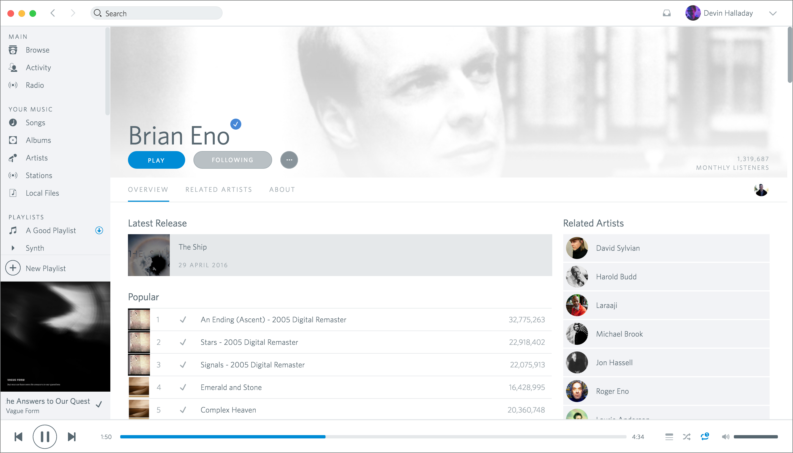

# Spotio for Spotify.app

I sorely miss Rdio. It was the perfect music streaming service: quality streaming, massive selection, perfect UX, beautiful UI, and wonderful social interaction features. When it was bought by Pandora, many of us were left out in the dust and were forced to choose between lesser services like Apple Music, Spotify, and Google Play Music.

**If you decided to go with Spotify but, like me, you miss Rdio's light UI, you're in luck—I discovered that you can skin the Spotify app with CSS.**

*Disclaimer: I have nothing but respect for the Spotify design and engineering teams, and undertaking this project has served only to increase that respect. They're really, really brilliant teams doing things that I admire greatly. I appreciate the design decisions they made while designing the app, but I prefer a light theme in my apps, so this project is merely an attempt to cater to my own selfish desires, not to do it "better" than the Spotify team did.*

---

# Download
To download Spotio, hit the [releases](https://github.com/devinhalladay/spotio/releases) page and download `Spotify.app.Binary.zip`. Unzip, and you'll have a shiny new Spotify.app that you can test out or replace your usual app with.

# To-do
- [ ] **HIGH PRIORITY:** Figure out how to get access to the rendered DOM from Chromium Embedded Framework so I can fully style all elements.
- [x] Streaming build system so I don't need to keep rebuilding and recompiling every single Sass file when I make a single change.
- [ ] Add a Grunt task to setup the local repo for people who have just cloned this repo for development.
- [ ] Add documentation guide for contributing to this repo.
- [ ] Design new icons for the app for `v1.0.0` public release.

# Known Skin Issues
- I'm not yet sure how to handle the release cycle for the Spotify app. While developing this skin I haven't encountered an update to the app so I don't know exactly how updates will effect Spotio. **For the time-being, please avoid updating your Spotify.app until I have figured out a new release cycle.**
- Contrast is an issue in some areas, but this is being fixed.
- Some album or artist header images are styled on Spotify's servers so they break the Spotio skin's look and feel, often making header text unreadable. I'm working on a workaround for this.

# Development
Originally, I used bash scripts to manage development for this app, but I switched to a streaming build system using Grunt.

## Known Development Issues
- I'm not yet sure how to handle the update cycle for the Spotify app. I don't know exactly how updates directly from Spotify will effect Spotio. **For the time-being, please avoid updating your Spotify.app until I have figured out a new release cycle.**
- Some Grunt tasks need to be tweaked to make cloning the repo for development easier.

## Grunt Tasks
- `sudo grunt`: Build all CSS and watch for changes
- `sudo grunt clean:spa`: Deletes all `.spa` files from .tmp/Spotify.app
- `sudo grunt clean:oldApps`: Deletes old apps in .tmp
- `sudo grunt download`: Downloads latest spotify binary and places it in .tmp/
- `sudo grunt shell:extract`: Extracts the most recently downloaded Spotify.app from .tmp/Spotify.dmg
- `grunt compress`: Compress your Spotify.app into a distributable .zip

---

# License

MIT License

Copyright (c) 2016 Devin Halladay studio@devinhalladay.com

Permission is hereby granted, free of charge, to any person obtaining a copy
of this software and associated documentation files (the "Software"), to deal
in the Software without restriction, including without limitation the rights
to use, copy, modify, merge, publish, distribute, sublicense, and/or sell
copies of the Software, and to permit persons to whom the Software is
furnished to do so, subject to the following conditions:

The above copyright notice and this permission notice shall be included in all
copies or substantial portions of the Software.

THE SOFTWARE IS PROVIDED "AS IS", WITHOUT WARRANTY OF ANY KIND, EXPRESS OR
IMPLIED, INCLUDING BUT NOT LIMITED TO THE WARRANTIES OF MERCHANTABILITY,
FITNESS FOR A PARTICULAR PURPOSE AND NONINFRINGEMENT. IN NO EVENT SHALL THE
AUTHORS OR COPYRIGHT HOLDERS BE LIABLE FOR ANY CLAIM, DAMAGES OR OTHER
LIABILITY, WHETHER IN AN ACTION OF CONTRACT, TORT OR OTHERWISE, ARISING FROM,
OUT OF OR IN CONNECTION WITH THE SOFTWARE OR THE USE OR OTHER DEALINGS IN THE
SOFTWARE.
